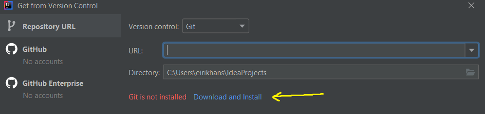
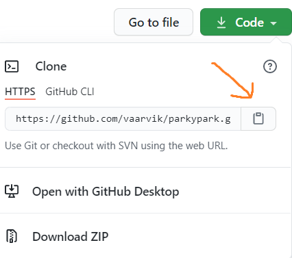
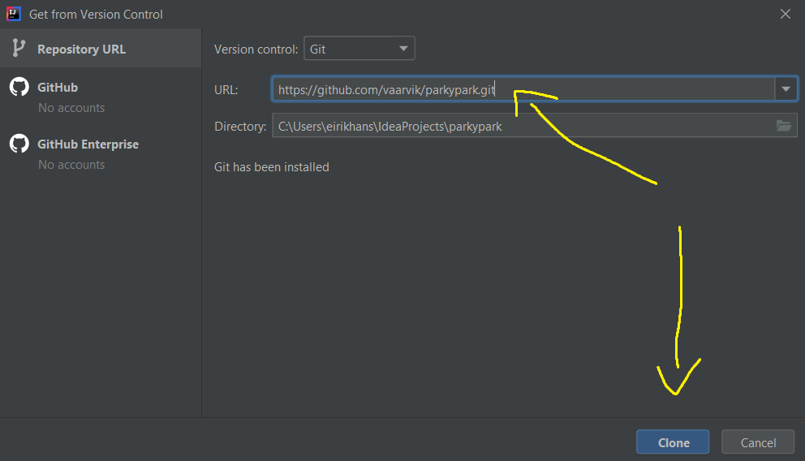
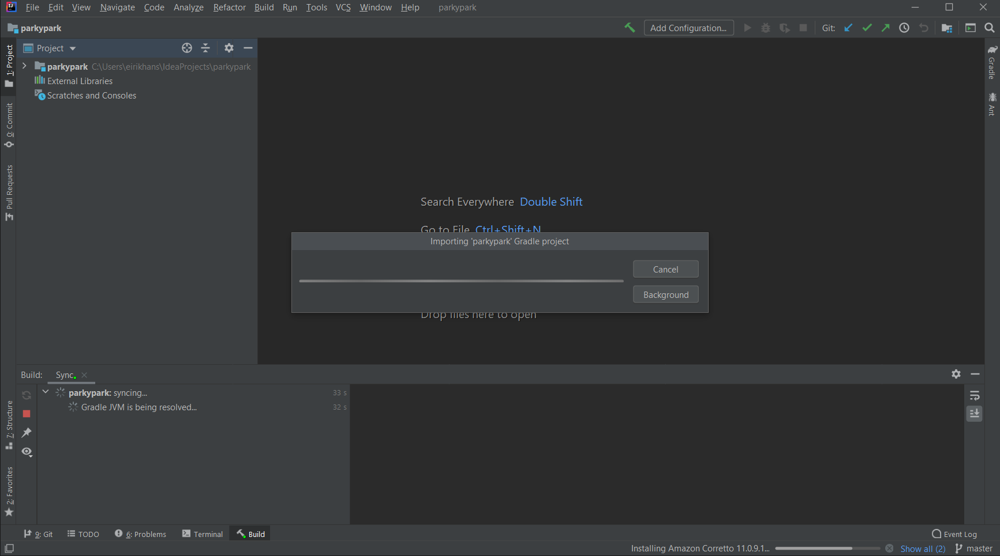
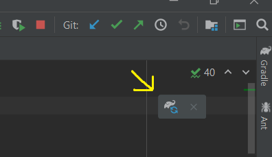
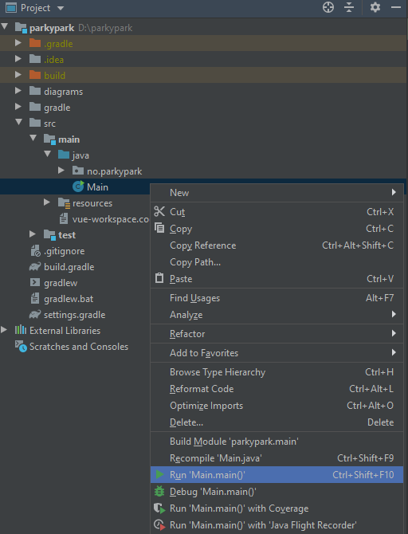
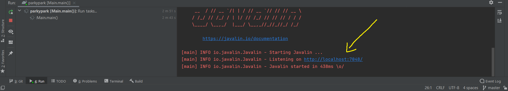
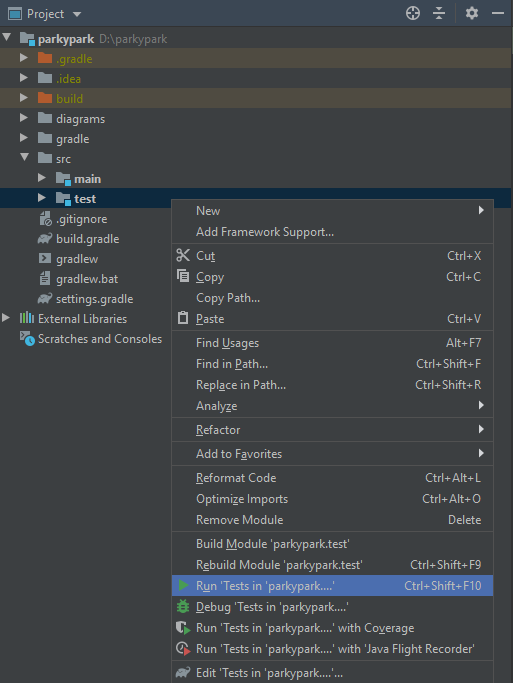

## ParkyPark
Dette er en prototype for en parkeringsløsning. 

## Beskrivelse
ParkyPark er en webapplikasjon som lar brukere legge ut og leie parkeringsplasser. 
Tanken er at leietakeren sparer penger på å ikke parkere i (for eksempel)
et parkeringshus, mens utleieren tjener penger ved å legge prisen lavere enn andre parkeringsplasser
i området. Man kan på et vis si at applikasjonen er som AirBnB for parkeringsplasser.

## Hvordan komme i gang
- Last ned og installer IntelliJ. Community Edition er tilstrekkelig.  ([Last ned her](https://www.jetbrains.com/idea/download/#section=windows))
- Åpne IntelliJ
- Velg Get from Version Control

- Last ned og installer Git

- Hent url fra Github. Trykk på den grønne Code knappen øverst og kopier linken.

- Lim inn URLen og trykk Clone nederst.

- Vent mens prosjektet bygger.

- Trykk på Load Gradle Changes

- Finn frem til main i prosjekt strukturen som vist på bildet under. Høyre klikk på main og velg Run 'Main.main()'.

- Nederst i IntelliJ vil det åpne seg et nytt vindu. Trykk på linken markert nedenfor og webapplikasjonen vil åpne seg.(Fungerer ikke å åpne i Internet Explorer)

## Hvordan kjøre tester
- Finn frem til test i prosjekt strukturen som vist på bildet under. Høyre klikk på test og velg Run 'Tests in 'parkypark....'.

## Avhengigheter for prototypen
- [Javalin (bruker slf4j-simple](https://javalin.io/documentation)
- [Vue](https://vuejs.org/v2/guide/)
- [Jackson](https://github.com/FasterXML/jackson-docs)

Avhengigheter for testing
- [JUnit5](https://junit.org/junit5/docs/current/user-guide/)
- [Mockito](https://site.mockito.org/)
